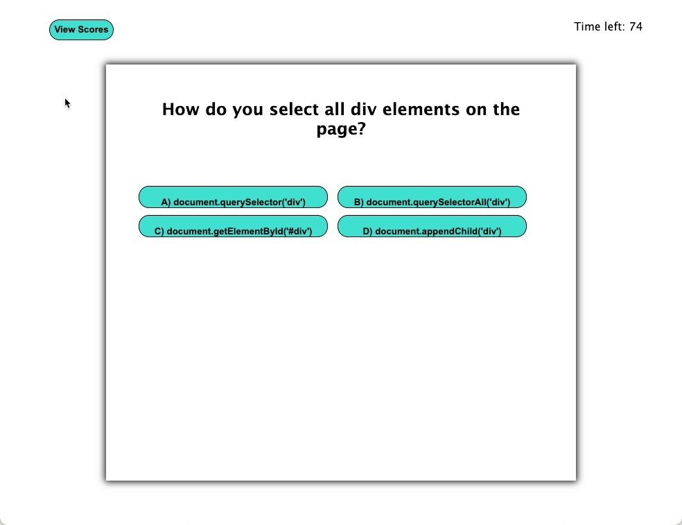

# JavaScript Quiz - Challenge 4

## Description

This is an application that will load a series of 4 questions, one at a time, and allow you to answer them. At the end of the game you'll be able to record your high scores. After each question your correct answers are stored. The high scores will be then stored to local storage, and will display on the screen. This was the 4th homework assignment for bootcamp. This exercise had helped me how to properly use functions, how to use objects, work a bit with the DOM, and set timers.

URL: https://gdjewell.github.io/4-javascript-quiz/

## Usage

1. Hit 'Begin Quiz' on the initial page.
2. Answer questions, 1 through 4.
3. At the end of the quiz, enter your initials to save your high score.

## Screenshot

